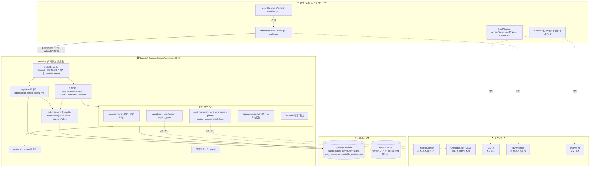
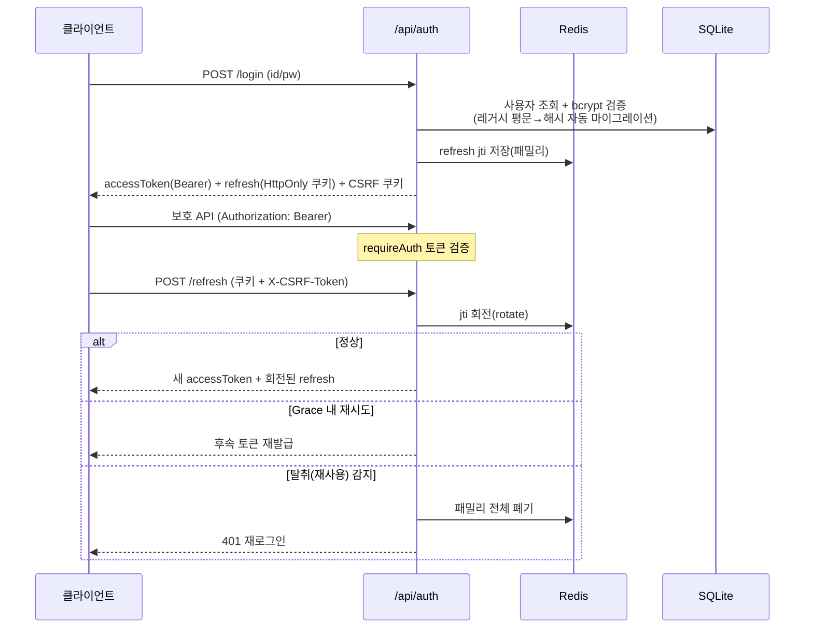

# TravelPlan 시스템 구성도

> 무장애(배리어프리) 여행 일정 공유 웹앱. 작성일 기준 코드 기반 구성도.

## 1. 전체 구성 (Mermaid)

## 2. 인증/보안 흐름 (RTR + Grace Period)

## 3. 계층 요약

| 계층 | 구성요소 | 역할 |
|---|---|---|
| **클라이언트** | `web/` (PWA, Leaflet, localStorage) | UI, 지도/미리보기, 토큰 보관 |
| **보안** | `security/` (JWT·RTR·bcrypt·CSRF·rateLimit·helmet) | 인증·인가·보호 (다른 프로젝트 재사용 가능) |
| **도메인 API** | `server/server.js` | 커뮤니티/일정/장소/접근성/QnA |
| **저장소** | SQLite, Redis(Docker) | 영속 데이터 / 토큰·잠금·레이트리밋 |
| **외부** | Photon·Overpass·OSRM·dummyjson·OSM타일 | 검색·POI추천·경로·리뷰·지도 |

## 4. 핵심 데이터 흐름

- **장소 검색**: 클라 → `/api/search` → Photon → 결과 반환
- **루트 주변 추천**: 클라 → `/api/community/:id/recommended-places` → Overpass(OSM, 캐시+미러) → 거리/카테고리 정리 → 클라가 평점·태그 적용
- **이동 지수(접근성 점수)**: `access-breakdown`이 장소별 접근성 후기(태그+턱/경사/폭 수치)와 도보 구간을 합산해 `100 − Σ감점` 산출 (카드/모달/추천 동일 규칙)
- **비슷한 동선**: 공통 장소(Jaccard) 유사도로 추천, 클릭 시 미니맵 미리보기
